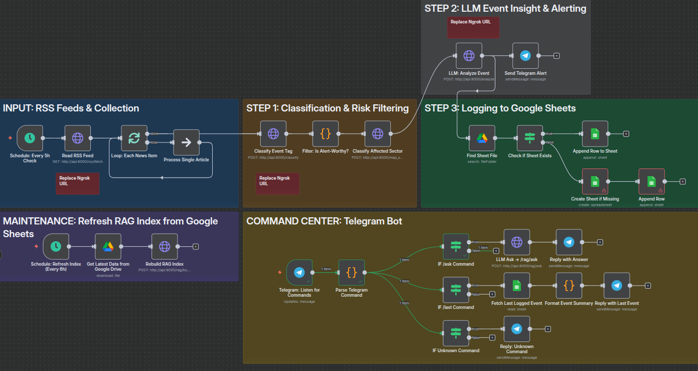

# 🧠 AI-Powered War Market Analyst

**An intelligent system for analyzing the economic impact of military events on market sectors**

[🇬🇧 English](#english-version) | [🇵🇱 Polski](#polska-wersja)


## 🇵🇱 Polska wersja

### 🌎 Opis projektu

Agent codziennie monitoruje wydarzenia wojskowe z kanałów **RSS** i innych serwisów:

| **Serwis**            | **Link RSS**                                                      |
| --------------------- | ----------------------------------------------------------------- |
| BreakingDefense       | [Link](https://breakingdefense.com/full-rss-feed/?v=2)            |
| War on the Rocks      | [Link](https://warontherocks.com/feed/)                           |
| Defense One           | [Link](https://www.defenseone.com/rss/all/)                       |
| The Drive             | [Link](https://www.thedrive.com/rss)                              |
| Military Times        | [Link](https://www.militarytimes.com/rss/)                        |
| The National Interest | [Link](https://nationalinterest.org/rss.xml)                      |
| The New York Times    | [Link](https://rss.nytimes.com/services/xml/rss/nyt/HomePage.xml) |
| The Defense Post      | [Link](https://thedefensepost.com/feed/)                          |
| The Economist         | [Link](https://www.economist.com/sections/international/rss)      |
| BBC World             | [Link](http://feeds.bbci.co.uk/news/world/rss.xml)                |
| CNN World             | [Link](http://rss.cnn.com/rss/edition_world.rss)                  |
| The Guardian World    | [Link](https://www.theguardian.com/world/rss)                     |

System:

* klasyfikuje wydarzenia (atak, sankcja, eskalacja itd.)
* mapuje je do odpowiednich sektorów (ropa, obronność, itd.)
* generuje analizę ekonomiczną (LLM)
* wysyła wynik na Telegram i zapisuje w Google Sheets

### 🧱 Struktura projektu

```

project_root/
├── data/                    # Dane: RSS, wektory, dane testowe
├── models/                  # Wytrenowany model Transformers
├── notebooks/               # Eksploracja danych, tagowanie, trening modelu
├── src/
│   ├── api/                 # Endpointy FastAPI
│   ├── services/            # Logika biznesowa 
│   ├── rss/                 # Pobieranie danych z RSS
│   ├── llm/                 # LLM Client (OpenRouter)
│   ├── rag/                 # Komponenty Retrieval-Augmented Generation
├── n8n/                     # Backup i konfiguracja workflow
├── tests/                  # Testy jednostkowe Pytest [TODO]
├── Dockerfile              # Aplikacja główna
├── Dockerfile.test         # Obraz testowy
├── docker-compose.yml      # Orkiestracja usług
├── ngrok.yml               # Tunelowanie webhooków (np. Telegram)
├── requirements.txt        # Zależności produkcyjne
├── requirments-dev.txt     # Zależności developerskie (testy, black, mypy)
└── streamlit_app.py        # interfejs frontendowy [TODO]

```


### 🧰 Architektura




### ⚙️ Technologie

| Technologia       | Funkcja                                                                 |
|-------------------|-------------------------------------------------------------------------|
| **Python**        | Logika klasyfikacji, mapowania, promptowania, RAG                       |
| **FastAPI**       | API do integracji z n8n (klasyfikacja, analiza, budowa indeksów)        |
| **Transformers**  | Klasyfikacja wydarzeń                                      |
| **Langchain**     | Budowa pipeline LLM + wektorowa pamięć FAISS                            |
| **FAISS**         | Przechowywanie wektorów do RAG                                          |
| **n8n**           | Orkiestracja: pobieranie danych, logika, warunki IF, powiadomienia      |
| **Google Sheets** | Przechowywanie historii analiz i wiedzy                                 |
| **Telegram Bot**  | Komunikacja z użytkownikiem: wyniki, komendy                            |
| **Docker**        | Uruchamianie aplikacji w kontenerach                                    |
| **Pytest**        | Testy jednostkowe                                                        |


### 🛠️ Instalacja

```bash
git clone https://github.com/midabrow/AI-Powered_War_Market_Analyst
cd AI-Powered_War_Market_Analyst
docker compose up --build
```


### 🔧 API Endpoints

Zobacz dokumentację w [docs/pl/api_reference.md](docs/pl/api_reference.md)


### 🚪 Przykładowy przepływ

1. Agent uruchamia się co 5h (n8n Trigger).
2. Pobiera nowe artykuły z kanałów RSS.
3. Każdy artykuł:

   * Klasyfikowany → `POST /classify`
   * Mapowany do sektora → `POST /map_sector`
   * Analizowany przez LLM → `POST /analyze`
4. Wynik trafia:

   * Na Telegram
   * Do arkusza Google Sheets

### **Interakcja z agentem przez Telegram**

Agent obsługuje również komendy tekstowe:

-   `/last` – zwraca **ostatnią analizę** zapisaną w Google Sheets.
    
-   `/ask <pytanie>` – zadaje pytanie agentowi (RAG pipeline z FAISS) i zwraca **odpowiedź generowaną przez LLM**, opartą na kontekście wcześniejszych wydarzeń.
    
Dzięki temu można nie tylko odbierać alerty, ale również **aktywnie zadawać pytania** agentowi i korzystać z jego wiedzy historycznej.

Więcej: [docs/pl/llm.md](docs/pl/llm.md)


## 🇬🇧 English Version

### 🌐 Project Description

This agent monitors military news from **RSS** and other feeds:

| **Website**            | **RSS Link**                                                      |
| --------------------- | ----------------------------------------------------------------- |
| BreakingDefense       | [Link](https://breakingdefense.com/full-rss-feed/?v=2)            |
| War on the Rocks      | [Link](https://warontherocks.com/feed/)                           |
| Defense One           | [Link](https://www.defenseone.com/rss/all/)                       |
| The Drive             | [Link](https://www.thedrive.com/rss)                              |
| Military Times        | [Link](https://www.militarytimes.com/rss/)                        |
| The National Interest | [Link](https://nationalinterest.org/rss.xml)                      |
| The New York Times    | [Link](https://rss.nytimes.com/services/xml/rss/nyt/HomePage.xml) |
| The Defense Post      | [Link](https://thedefensepost.com/feed/)                          |
| The Economist         | [Link](https://www.economist.com/sections/international/rss)      |
| BBC World             | [Link](http://feeds.bbci.co.uk/news/world/rss.xml)                |
| CNN World             | [Link](http://rss.cnn.com/rss/edition_world.rss)                  |
| The Guardian World    | [Link](https://www.theguardian.com/world/rss)                     |

It:

* classifies events (attack, sanction, escalation, etc.)
* maps them to sectors (e.g. oil, defense)
* generates an economic analysis using LLM
* sends the result to Telegram and stores it in Google Sheets


### 🧱 Project Structure

```
project_root/
├── data/                    # Data: RSS feeds, vectors, test data
├── models/                  # Trained Transformers model
├── notebooks/               # Data exploration, tagging, model training
├── src/
│   ├── api/                 # FastAPI endpoints
│   ├── services/            # Business logic
│   ├── rss/                 # RSS data fetching
│   ├── llm/                 # LLM client (OpenRouter)
│   ├── rag/                 # Retrieval-Augmented Generation components
├── n8n/                     # Workflow backups and configuration
├── tests/                   # Pytest unit tests
├── Dockerfile               # Main application
├── Dockerfile.test          # Test image
├── docker-compose.yml       # Service orchestration
├── ngrok.yml                # Webhook tunneling (e.g., Telegram)
├── requirements.txt         # Production dependencies
├── requirements-dev.txt     # Development dependencies (tests, black, mypy)
└── streamlit_app.py         # (optional) frontend interface
```


### 🧰 Architecture


### ⚙️ Technologies

| Technology        | Role                                                                 |
|-------------------|----------------------------------------------------------------------|
| **Python**        | Logic for classification, mapping, prompting, RAG                   |
| **FastAPI**       | API for integration with n8n (classification, analysis, index building) |
| **Transformers**  | Event classification                                                 |
| **Langchain**     | LLM pipeline + FAISS vector memory                                   |
| **FAISS**         | Vector storage for RAG                                               |
| **n8n**           | Orchestration: data fetching, logic, IF conditions, notifications    |
| **Google Sheets** | Storing historical analyses and knowledge base                      |
| **Telegram Bot**  | User communication: results and commands                             |
| **Docker**        | Running the application in containers                                |
| **Pytest**        | Unit testing                                                         |


### 🛠️ Installation

```bash
git clone https://github.com/midabrow/AI-Powered_War_Market_Analyst
cd AI-Powered_War_Market_Analyst
docker compose up --build
```


### 🔧 API Endpoints

See documentation at [docs/en/api_reference.md](docs/en/api_reference.md)


### 🚪 Example Flow

1. The agent is triggered every 5 hours (n8n Trigger).

2. It fetches new articles from RSS feeds.

3. Each article is:

   * Classified → `POST /classify`
   * Mapped to a market sector → `POST /map_sector`
   * Analyzed using an LLM → `POST /analyze`

4. The result is:

   * Sent to Telegram
   * Saved to Google Sheets


### **Interaction via Telegram Bot**

The agent also supports text commands:

* `/last` – returns the **latest analysis** stored in Google Sheets.
* `/ask <question>` – sends a question to the agent (RAG pipeline with FAISS) and returns an **LLM-generated answer**, based on the context of past events.

This allows users not only to receive alerts, but also to **actively ask questions** and benefit from the agent's historical knowledge.

See: [docs/eng/llm.md](docs/en/llm.md)


